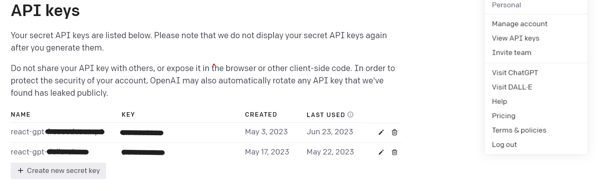

# ChatGPT Clone
This is the MVP for a ChatGPT Clone I made using React & NodeJS.

To clone this project and make it your own, follow the [Setup](#setup) instructions below.

-----

## Requirements
* React v18.2.0
* NodeJS v16.19.0
* Express v4.18.2


---
## Setup<a id="setup"></a>
1. Clone this repository to your local directory, and install dependencies.

```
npm install
```
2. To create your own API Key, go to [OpenAI's API website](https://platform.openai.com/docs/introduction) and create & setup a personal account. You'll need to set up billing and rate limits, as using their AI is inexpensive but not free.

3. Once you've set up your account with OpenAI, click on the upper right icon and go to "View API Keys"




4. At the root of your local directory, create a new file called ```.env```. [(see notes on keeping your API Key a secret below)](#secret).

5. Create a new secret key in OpenAI's API keys page, and copy the key. Paste this key in your new ```.env``` file, as such:
```
// .env line 1
API_KEY=z3BlbkFJGTYeJlAVKPoPptJeCfqnfNASOFnaFnafnsaof
```
NOTE: THIS IS A DUMMY KEY FOR DEMONSTRATION PURPOSES ONLY! KEEP YOUR API KEY A SECRET!

6. Back in your local environment, start up the backend.
```
npm run start:backend
```

7. Run the frontend
```
npm run start:frontend
```

8. Open the app in your browser at ```localhost:5173```.

From here you're welcome to integrate and style your ChatGPT clone any way you see fit. Enjoy!
_____


### Note on keeping your API Key a secret<a id="secret"></a>

KEEP YOUR API KEY A SECRET! 

The ```.env``` file you've created to store your secret API key should be listed in this repo's .gitignore file, so future commits & branches will not include your secret API key. Exposed API keys will likely be detected & auto-deleted by OpenAI, in which case you'll need to create a new key and repeat these steps. Never copy your API key anywhere else. When in doubt, create a new API key.

_____
## Credit

Credit: freecodecamp tutorial https://www.youtube.com/watch?v=uRQH2CFvedY

## License
[Read the license here](./LICENSE)